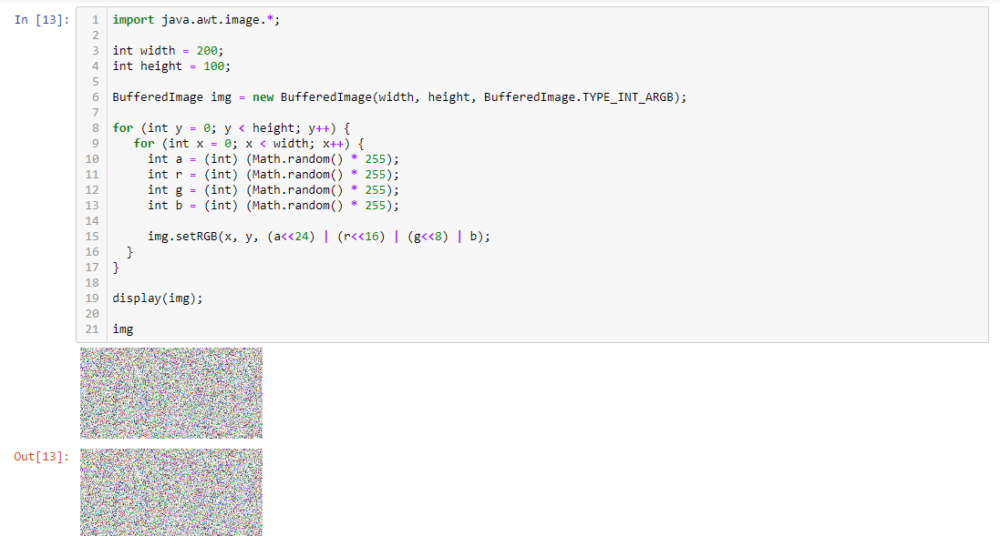
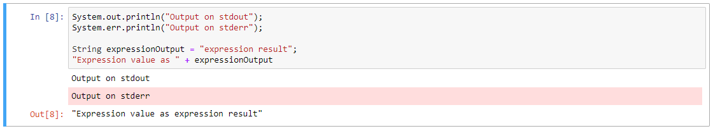
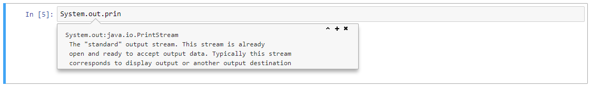
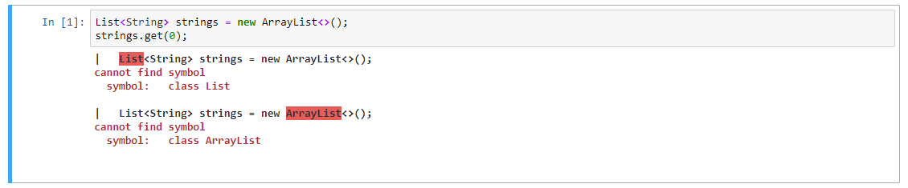
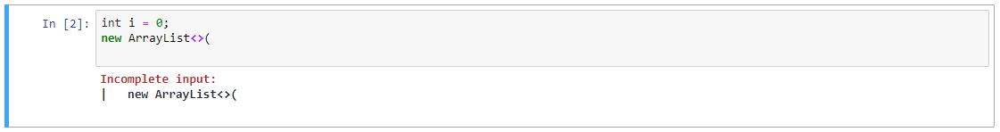
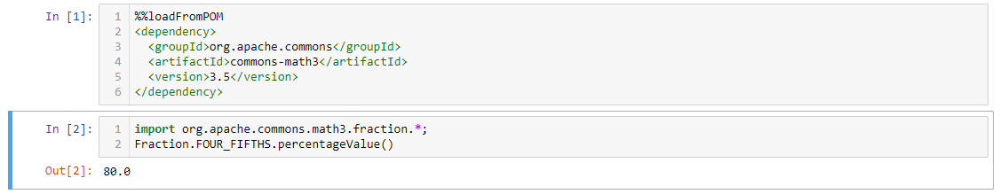
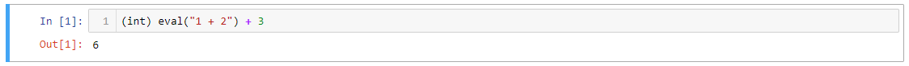
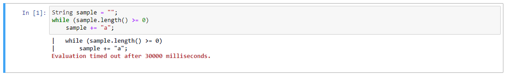

# IJava

[![badge](https://img.shields.io/badge/launch-binder-E66581.svg?logo=data:image/png;base64,iVBORw0KGgoAAAANSUhEUgAAAFkAAABZCAMAAABi1XidAAAB8lBMVEX///9XmsrmZYH1olJXmsr1olJXmsrmZYH1olJXmsr1olJXmsrmZYH1olL1olJXmsr1olJXmsrmZYH1olL1olJXmsrmZYH1olJXmsr1olL1olJXmsrmZYH1olL1olJXmsrmZYH1olL1olL0nFf1olJXmsrmZYH1olJXmsq8dZb1olJXmsrmZYH1olJXmspXmspXmsr1olL1olJXmsrmZYH1olJXmsr1olL1olJXmsrmZYH1olL1olLeaIVXmsrmZYH1olL1olL1olJXmsrmZYH1olLna31Xmsr1olJXmsr1olJXmsrmZYH1olLqoVr1olJXmsr1olJXmsrmZYH1olL1olKkfaPobXvviGabgadXmsqThKuofKHmZ4Dobnr1olJXmsr1olJXmspXmsr1olJXmsrfZ4TuhWn1olL1olJXmsqBi7X1olJXmspZmslbmMhbmsdemsVfl8ZgmsNim8Jpk8F0m7R4m7F5nLB6jbh7jbiDirOEibOGnKaMhq+PnaCVg6qWg6qegKaff6WhnpKofKGtnomxeZy3noG6dZi+n3vCcpPDcpPGn3bLb4/Mb47UbIrVa4rYoGjdaIbeaIXhoWHmZYHobXvpcHjqdHXreHLroVrsfG/uhGnuh2bwj2Hxk17yl1vzmljzm1j0nlX1olL3AJXWAAAAbXRSTlMAEBAQHx8gICAuLjAwMDw9PUBAQEpQUFBXV1hgYGBkcHBwcXl8gICAgoiIkJCQlJicnJ2goKCmqK+wsLC4usDAwMjP0NDQ1NbW3Nzg4ODi5+3v8PDw8/T09PX29vb39/f5+fr7+/z8/Pz9/v7+zczCxgAABC5JREFUeAHN1ul3k0UUBvCb1CTVpmpaitAGSLSpSuKCLWpbTKNJFGlcSMAFF63iUmRccNG6gLbuxkXU66JAUef/9LSpmXnyLr3T5AO/rzl5zj137p136BISy44fKJXuGN/d19PUfYeO67Znqtf2KH33Id1psXoFdW30sPZ1sMvs2D060AHqws4FHeJojLZqnw53cmfvg+XR8mC0OEjuxrXEkX5ydeVJLVIlV0e10PXk5k7dYeHu7Cj1j+49uKg7uLU61tGLw1lq27ugQYlclHC4bgv7VQ+TAyj5Zc/UjsPvs1sd5cWryWObtvWT2EPa4rtnWW3JkpjggEpbOsPr7F7EyNewtpBIslA7p43HCsnwooXTEc3UmPmCNn5lrqTJxy6nRmcavGZVt/3Da2pD5NHvsOHJCrdc1G2r3DITpU7yic7w/7Rxnjc0kt5GC4djiv2Sz3Fb2iEZg41/ddsFDoyuYrIkmFehz0HR2thPgQqMyQYb2OtB0WxsZ3BeG3+wpRb1vzl2UYBog8FfGhttFKjtAclnZYrRo9ryG9uG/FZQU4AEg8ZE9LjGMzTmqKXPLnlWVnIlQQTvxJf8ip7VgjZjyVPrjw1te5otM7RmP7xm+sK2Gv9I8Gi++BRbEkR9EBw8zRUcKxwp73xkaLiqQb+kGduJTNHG72zcW9LoJgqQxpP3/Tj//c3yB0tqzaml05/+orHLksVO+95kX7/7qgJvnjlrfr2Ggsyx0eoy9uPzN5SPd86aXggOsEKW2Prz7du3VID3/tzs/sSRs2w7ovVHKtjrX2pd7ZMlTxAYfBAL9jiDwfLkq55Tm7ifhMlTGPyCAs7RFRhn47JnlcB9RM5T97ASuZXIcVNuUDIndpDbdsfrqsOppeXl5Y+XVKdjFCTh+zGaVuj0d9zy05PPK3QzBamxdwtTCrzyg/2Rvf2EstUjordGwa/kx9mSJLr8mLLtCW8HHGJc2R5hS219IiF6PnTusOqcMl57gm0Z8kanKMAQg0qSyuZfn7zItsbGyO9QlnxY0eCuD1XL2ys/MsrQhltE7Ug0uFOzufJFE2PxBo/YAx8XPPdDwWN0MrDRYIZF0mSMKCNHgaIVFoBbNoLJ7tEQDKxGF0kcLQimojCZopv0OkNOyWCCg9XMVAi7ARJzQdM2QUh0gmBozjc3Skg6dSBRqDGYSUOu66Zg+I2fNZs/M3/f/Grl/XnyF1Gw3VKCez0PN5IUfFLqvgUN4C0qNqYs5YhPL+aVZYDE4IpUk57oSFnJm4FyCqqOE0jhY2SMyLFoo56zyo6becOS5UVDdj7Vih0zp+tcMhwRpBeLyqtIjlJKAIZSbI8SGSF3k0pA3mR5tHuwPFoa7N7reoq2bqCsAk1HqCu5uvI1n6JuRXI+S1Mco54YmYTwcn6Aeic+kssXi8XpXC4V3t7/ADuTNKaQJdScAAAAAElFTkSuQmCC)](https://mybinder.org/v2/gh/SpencerPark/ijava-binder/master) [![badge](https://img.shields.io/badge/launch-binder%20lab-579ACA.svg?logo=data:image/png;base64,iVBORw0KGgoAAAANSUhEUgAAAFkAAABZCAMAAABi1XidAAAB8lBMVEX///9XmsrmZYH1olJXmsr1olJXmsrmZYH1olJXmsr1olJXmsrmZYH1olL1olJXmsr1olJXmsrmZYH1olL1olJXmsrmZYH1olJXmsr1olL1olJXmsrmZYH1olL1olJXmsrmZYH1olL1olL0nFf1olJXmsrmZYH1olJXmsq8dZb1olJXmsrmZYH1olJXmspXmspXmsr1olL1olJXmsrmZYH1olJXmsr1olL1olJXmsrmZYH1olL1olLeaIVXmsrmZYH1olL1olL1olJXmsrmZYH1olLna31Xmsr1olJXmsr1olJXmsrmZYH1olLqoVr1olJXmsr1olJXmsrmZYH1olL1olKkfaPobXvviGabgadXmsqThKuofKHmZ4Dobnr1olJXmsr1olJXmspXmsr1olJXmsrfZ4TuhWn1olL1olJXmsqBi7X1olJXmspZmslbmMhbmsdemsVfl8ZgmsNim8Jpk8F0m7R4m7F5nLB6jbh7jbiDirOEibOGnKaMhq+PnaCVg6qWg6qegKaff6WhnpKofKGtnomxeZy3noG6dZi+n3vCcpPDcpPGn3bLb4/Mb47UbIrVa4rYoGjdaIbeaIXhoWHmZYHobXvpcHjqdHXreHLroVrsfG/uhGnuh2bwj2Hxk17yl1vzmljzm1j0nlX1olL3AJXWAAAAbXRSTlMAEBAQHx8gICAuLjAwMDw9PUBAQEpQUFBXV1hgYGBkcHBwcXl8gICAgoiIkJCQlJicnJ2goKCmqK+wsLC4usDAwMjP0NDQ1NbW3Nzg4ODi5+3v8PDw8/T09PX29vb39/f5+fr7+/z8/Pz9/v7+zczCxgAABC5JREFUeAHN1ul3k0UUBvCb1CTVpmpaitAGSLSpSuKCLWpbTKNJFGlcSMAFF63iUmRccNG6gLbuxkXU66JAUef/9LSpmXnyLr3T5AO/rzl5zj137p136BISy44fKJXuGN/d19PUfYeO67Znqtf2KH33Id1psXoFdW30sPZ1sMvs2D060AHqws4FHeJojLZqnw53cmfvg+XR8mC0OEjuxrXEkX5ydeVJLVIlV0e10PXk5k7dYeHu7Cj1j+49uKg7uLU61tGLw1lq27ugQYlclHC4bgv7VQ+TAyj5Zc/UjsPvs1sd5cWryWObtvWT2EPa4rtnWW3JkpjggEpbOsPr7F7EyNewtpBIslA7p43HCsnwooXTEc3UmPmCNn5lrqTJxy6nRmcavGZVt/3Da2pD5NHvsOHJCrdc1G2r3DITpU7yic7w/7Rxnjc0kt5GC4djiv2Sz3Fb2iEZg41/ddsFDoyuYrIkmFehz0HR2thPgQqMyQYb2OtB0WxsZ3BeG3+wpRb1vzl2UYBog8FfGhttFKjtAclnZYrRo9ryG9uG/FZQU4AEg8ZE9LjGMzTmqKXPLnlWVnIlQQTvxJf8ip7VgjZjyVPrjw1te5otM7RmP7xm+sK2Gv9I8Gi++BRbEkR9EBw8zRUcKxwp73xkaLiqQb+kGduJTNHG72zcW9LoJgqQxpP3/Tj//c3yB0tqzaml05/+orHLksVO+95kX7/7qgJvnjlrfr2Ggsyx0eoy9uPzN5SPd86aXggOsEKW2Prz7du3VID3/tzs/sSRs2w7ovVHKtjrX2pd7ZMlTxAYfBAL9jiDwfLkq55Tm7ifhMlTGPyCAs7RFRhn47JnlcB9RM5T97ASuZXIcVNuUDIndpDbdsfrqsOppeXl5Y+XVKdjFCTh+zGaVuj0d9zy05PPK3QzBamxdwtTCrzyg/2Rvf2EstUjordGwa/kx9mSJLr8mLLtCW8HHGJc2R5hS219IiF6PnTusOqcMl57gm0Z8kanKMAQg0qSyuZfn7zItsbGyO9QlnxY0eCuD1XL2ys/MsrQhltE7Ug0uFOzufJFE2PxBo/YAx8XPPdDwWN0MrDRYIZF0mSMKCNHgaIVFoBbNoLJ7tEQDKxGF0kcLQimojCZopv0OkNOyWCCg9XMVAi7ARJzQdM2QUh0gmBozjc3Skg6dSBRqDGYSUOu66Zg+I2fNZs/M3/f/Grl/XnyF1Gw3VKCez0PN5IUfFLqvgUN4C0qNqYs5YhPL+aVZYDE4IpUk57oSFnJm4FyCqqOE0jhY2SMyLFoo56zyo6becOS5UVDdj7Vih0zp+tcMhwRpBeLyqtIjlJKAIZSbI8SGSF3k0pA3mR5tHuwPFoa7N7reoq2bqCsAk1HqCu5uvI1n6JuRXI+S1Mco54YmYTwcn6Aeic+kssXi8XpXC4V3t7/ADuTNKaQJdScAAAAAElFTkSuQmCC)](https://mybinder.org/v2/gh/SpencerPark/ijava-binder/master?urlpath=lab)



A [Jupyter](http://jupyter.org/) kernel for executing Java code. The kernel executes code via the new [JShell tool](https://docs.oracle.com/javase/9/jshell/introduction-jshell.htm). Some of the additional commands should be supported as needed via a syntax similar to the ipython magics.

The kernel is fully functional. Check out the [list of features](#features) further down in the README. Any requests for new ones or prioritizing current requests are welcomed in the [issues](https://github.com/SpencerPark/IJava/issues) along with bug requests, installation help, or other questions.

If you are interested in building your own kernel that runs on the JVM check out the related project that this kernel is build on, [jupyter-jvm-basekernel](https://github.com/SpencerPark/jupyter-jvm-basekernel).

### Contents

*   [Try online](#try-online)
*   [Features](#features)
*   [Requirements](#requirements)
*   [Installing](#installing)
    *   [Install pre-build binary](#install-pre-built-binary)
    *   [Install from source](#install-from-source)
*   [Configuring](#configuring)
    *   [List of options](#list-of-options)
    *   [Changing VM/compiler options](#changing-vmcompiler-options)
    *   [Configuring startup scripts](#configuring-startup-scripts)
*   [Run](#run)

### Try Online

Clicking on the [![badge](https://img.shields.io/badge/launch-binder-E66581.svg?logo=data:image/png;base64,iVBORw0KGgoAAAANSUhEUgAAAFkAAABZCAMAAABi1XidAAAB8lBMVEX///9XmsrmZYH1olJXmsr1olJXmsrmZYH1olJXmsr1olJXmsrmZYH1olL1olJXmsr1olJXmsrmZYH1olL1olJXmsrmZYH1olJXmsr1olL1olJXmsrmZYH1olL1olJXmsrmZYH1olL1olL0nFf1olJXmsrmZYH1olJXmsq8dZb1olJXmsrmZYH1olJXmspXmspXmsr1olL1olJXmsrmZYH1olJXmsr1olL1olJXmsrmZYH1olL1olLeaIVXmsrmZYH1olL1olL1olJXmsrmZYH1olLna31Xmsr1olJXmsr1olJXmsrmZYH1olLqoVr1olJXmsr1olJXmsrmZYH1olL1olKkfaPobXvviGabgadXmsqThKuofKHmZ4Dobnr1olJXmsr1olJXmspXmsr1olJXmsrfZ4TuhWn1olL1olJXmsqBi7X1olJXmspZmslbmMhbmsdemsVfl8ZgmsNim8Jpk8F0m7R4m7F5nLB6jbh7jbiDirOEibOGnKaMhq+PnaCVg6qWg6qegKaff6WhnpKofKGtnomxeZy3noG6dZi+n3vCcpPDcpPGn3bLb4/Mb47UbIrVa4rYoGjdaIbeaIXhoWHmZYHobXvpcHjqdHXreHLroVrsfG/uhGnuh2bwj2Hxk17yl1vzmljzm1j0nlX1olL3AJXWAAAAbXRSTlMAEBAQHx8gICAuLjAwMDw9PUBAQEpQUFBXV1hgYGBkcHBwcXl8gICAgoiIkJCQlJicnJ2goKCmqK+wsLC4usDAwMjP0NDQ1NbW3Nzg4ODi5+3v8PDw8/T09PX29vb39/f5+fr7+/z8/Pz9/v7+zczCxgAABC5JREFUeAHN1ul3k0UUBvCb1CTVpmpaitAGSLSpSuKCLWpbTKNJFGlcSMAFF63iUmRccNG6gLbuxkXU66JAUef/9LSpmXnyLr3T5AO/rzl5zj137p136BISy44fKJXuGN/d19PUfYeO67Znqtf2KH33Id1psXoFdW30sPZ1sMvs2D060AHqws4FHeJojLZqnw53cmfvg+XR8mC0OEjuxrXEkX5ydeVJLVIlV0e10PXk5k7dYeHu7Cj1j+49uKg7uLU61tGLw1lq27ugQYlclHC4bgv7VQ+TAyj5Zc/UjsPvs1sd5cWryWObtvWT2EPa4rtnWW3JkpjggEpbOsPr7F7EyNewtpBIslA7p43HCsnwooXTEc3UmPmCNn5lrqTJxy6nRmcavGZVt/3Da2pD5NHvsOHJCrdc1G2r3DITpU7yic7w/7Rxnjc0kt5GC4djiv2Sz3Fb2iEZg41/ddsFDoyuYrIkmFehz0HR2thPgQqMyQYb2OtB0WxsZ3BeG3+wpRb1vzl2UYBog8FfGhttFKjtAclnZYrRo9ryG9uG/FZQU4AEg8ZE9LjGMzTmqKXPLnlWVnIlQQTvxJf8ip7VgjZjyVPrjw1te5otM7RmP7xm+sK2Gv9I8Gi++BRbEkR9EBw8zRUcKxwp73xkaLiqQb+kGduJTNHG72zcW9LoJgqQxpP3/Tj//c3yB0tqzaml05/+orHLksVO+95kX7/7qgJvnjlrfr2Ggsyx0eoy9uPzN5SPd86aXggOsEKW2Prz7du3VID3/tzs/sSRs2w7ovVHKtjrX2pd7ZMlTxAYfBAL9jiDwfLkq55Tm7ifhMlTGPyCAs7RFRhn47JnlcB9RM5T97ASuZXIcVNuUDIndpDbdsfrqsOppeXl5Y+XVKdjFCTh+zGaVuj0d9zy05PPK3QzBamxdwtTCrzyg/2Rvf2EstUjordGwa/kx9mSJLr8mLLtCW8HHGJc2R5hS219IiF6PnTusOqcMl57gm0Z8kanKMAQg0qSyuZfn7zItsbGyO9QlnxY0eCuD1XL2ys/MsrQhltE7Ug0uFOzufJFE2PxBo/YAx8XPPdDwWN0MrDRYIZF0mSMKCNHgaIVFoBbNoLJ7tEQDKxGF0kcLQimojCZopv0OkNOyWCCg9XMVAi7ARJzQdM2QUh0gmBozjc3Skg6dSBRqDGYSUOu66Zg+I2fNZs/M3/f/Grl/XnyF1Gw3VKCez0PN5IUfFLqvgUN4C0qNqYs5YhPL+aVZYDE4IpUk57oSFnJm4FyCqqOE0jhY2SMyLFoo56zyo6becOS5UVDdj7Vih0zp+tcMhwRpBeLyqtIjlJKAIZSbI8SGSF3k0pA3mR5tHuwPFoa7N7reoq2bqCsAk1HqCu5uvI1n6JuRXI+S1Mco54YmYTwcn6Aeic+kssXi8XpXC4V3t7/ADuTNKaQJdScAAAAAElFTkSuQmCC)](https://mybinder.org/v2/gh/SpencerPark/ijava-binder/master) [![badge](https://img.shields.io/badge/launch-binder%20lab-579ACA.svg?logo=data:image/png;base64,iVBORw0KGgoAAAANSUhEUgAAAFkAAABZCAMAAABi1XidAAAB8lBMVEX///9XmsrmZYH1olJXmsr1olJXmsrmZYH1olJXmsr1olJXmsrmZYH1olL1olJXmsr1olJXmsrmZYH1olL1olJXmsrmZYH1olJXmsr1olL1olJXmsrmZYH1olL1olJXmsrmZYH1olL1olL0nFf1olJXmsrmZYH1olJXmsq8dZb1olJXmsrmZYH1olJXmspXmspXmsr1olL1olJXmsrmZYH1olJXmsr1olL1olJXmsrmZYH1olL1olLeaIVXmsrmZYH1olL1olL1olJXmsrmZYH1olLna31Xmsr1olJXmsr1olJXmsrmZYH1olLqoVr1olJXmsr1olJXmsrmZYH1olL1olKkfaPobXvviGabgadXmsqThKuofKHmZ4Dobnr1olJXmsr1olJXmspXmsr1olJXmsrfZ4TuhWn1olL1olJXmsqBi7X1olJXmspZmslbmMhbmsdemsVfl8ZgmsNim8Jpk8F0m7R4m7F5nLB6jbh7jbiDirOEibOGnKaMhq+PnaCVg6qWg6qegKaff6WhnpKofKGtnomxeZy3noG6dZi+n3vCcpPDcpPGn3bLb4/Mb47UbIrVa4rYoGjdaIbeaIXhoWHmZYHobXvpcHjqdHXreHLroVrsfG/uhGnuh2bwj2Hxk17yl1vzmljzm1j0nlX1olL3AJXWAAAAbXRSTlMAEBAQHx8gICAuLjAwMDw9PUBAQEpQUFBXV1hgYGBkcHBwcXl8gICAgoiIkJCQlJicnJ2goKCmqK+wsLC4usDAwMjP0NDQ1NbW3Nzg4ODi5+3v8PDw8/T09PX29vb39/f5+fr7+/z8/Pz9/v7+zczCxgAABC5JREFUeAHN1ul3k0UUBvCb1CTVpmpaitAGSLSpSuKCLWpbTKNJFGlcSMAFF63iUmRccNG6gLbuxkXU66JAUef/9LSpmXnyLr3T5AO/rzl5zj137p136BISy44fKJXuGN/d19PUfYeO67Znqtf2KH33Id1psXoFdW30sPZ1sMvs2D060AHqws4FHeJojLZqnw53cmfvg+XR8mC0OEjuxrXEkX5ydeVJLVIlV0e10PXk5k7dYeHu7Cj1j+49uKg7uLU61tGLw1lq27ugQYlclHC4bgv7VQ+TAyj5Zc/UjsPvs1sd5cWryWObtvWT2EPa4rtnWW3JkpjggEpbOsPr7F7EyNewtpBIslA7p43HCsnwooXTEc3UmPmCNn5lrqTJxy6nRmcavGZVt/3Da2pD5NHvsOHJCrdc1G2r3DITpU7yic7w/7Rxnjc0kt5GC4djiv2Sz3Fb2iEZg41/ddsFDoyuYrIkmFehz0HR2thPgQqMyQYb2OtB0WxsZ3BeG3+wpRb1vzl2UYBog8FfGhttFKjtAclnZYrRo9ryG9uG/FZQU4AEg8ZE9LjGMzTmqKXPLnlWVnIlQQTvxJf8ip7VgjZjyVPrjw1te5otM7RmP7xm+sK2Gv9I8Gi++BRbEkR9EBw8zRUcKxwp73xkaLiqQb+kGduJTNHG72zcW9LoJgqQxpP3/Tj//c3yB0tqzaml05/+orHLksVO+95kX7/7qgJvnjlrfr2Ggsyx0eoy9uPzN5SPd86aXggOsEKW2Prz7du3VID3/tzs/sSRs2w7ovVHKtjrX2pd7ZMlTxAYfBAL9jiDwfLkq55Tm7ifhMlTGPyCAs7RFRhn47JnlcB9RM5T97ASuZXIcVNuUDIndpDbdsfrqsOppeXl5Y+XVKdjFCTh+zGaVuj0d9zy05PPK3QzBamxdwtTCrzyg/2Rvf2EstUjordGwa/kx9mSJLr8mLLtCW8HHGJc2R5hS219IiF6PnTusOqcMl57gm0Z8kanKMAQg0qSyuZfn7zItsbGyO9QlnxY0eCuD1XL2ys/MsrQhltE7Ug0uFOzufJFE2PxBo/YAx8XPPdDwWN0MrDRYIZF0mSMKCNHgaIVFoBbNoLJ7tEQDKxGF0kcLQimojCZopv0OkNOyWCCg9XMVAi7ARJzQdM2QUh0gmBozjc3Skg6dSBRqDGYSUOu66Zg+I2fNZs/M3/f/Grl/XnyF1Gw3VKCez0PN5IUfFLqvgUN4C0qNqYs5YhPL+aVZYDE4IpUk57oSFnJm4FyCqqOE0jhY2SMyLFoo56zyo6becOS5UVDdj7Vih0zp+tcMhwRpBeLyqtIjlJKAIZSbI8SGSF3k0pA3mR5tHuwPFoa7N7reoq2bqCsAk1HqCu5uvI1n6JuRXI+S1Mco54YmYTwcn6Aeic+kssXi8XpXC4V3t7/ADuTNKaQJdScAAAAAElFTkSuQmCC)](https://mybinder.org/v2/gh/SpencerPark/ijava-binder/master?urlpath=lab) badges at the top (or right here) will spawn a jupyter server running this kernel. The binder base is the [ijava-binder project](https://github.com/SpencerPark/ijava-binder).

### Features

Currently the kernel supports

*   Code execution.
    
*   Autocompletion (`TAB` in Jupyter notebook).
    
*   Code inspection (`Shift-TAB` up to 4 times in Jupyter notebook).
    
*   Colored, friendly, error message displays.
    
    
    
*   Add maven dependencies at runtime (See also [magics.md](docs/magics.md) and [Try the example ](https://mybinder.org/v2/gh/SpencerPark/ijava-binder/master?urlpath=lab/tree/home/jovyan/3rdPartyDependency.ipynb)).
    
*   Display rich output (See also [display.md](docs/display.md) and [maven magic](docs/magics.md#addmavendependencies)). Chart library in the demo photo is [XChart](https://github.com/knowm/XChart) with the sample code taken from their README. ([Try the example ](https://mybinder.org/v2/gh/SpencerPark/ijava-binder/master?urlpath=lab/tree/home/jovyan/3rdPartyDependency.ipynb))
    
*   `eval` function. (See also [kernel.md](docs/kernel.md)) **Note: the signature is `Object eval(String) throws Exception`.** This evaluates the expression (a cell) in the user scope and returns the actual evaluation result instead of a serialized one.
    
*   Configurable evaluation timeout
    

### Requirements

1.  [Java JDK >= 9](http://www.oracle.com/technetwork/java/javase/downloads/index.html). **Not the JRE**. Java 12 is the current release and should be considered if selecting a version but if a java 9, 10, or 11 build is installed, everything _should_ still be working fine.

    1.  Ensure that the `java` command is in the PATH and is using version 9. For example:
        ```bash
        > java -version
        java version "9"
        Java(TM) SE Runtime Environment (build 9+181)
        Java HotSpot(TM) 64-Bit Server VM (build 9+181, mixed mode)
        ```

    2.  Next ensure that `java` is in a location where the jdk was installed and not just the jre. Use the `java --list-modules` command to do this. The list should contain `jdk.jshell`.

        *   On *nix `java --list-modules | grep "jdk.jshell"`
        *   On windows `java --list-modules | findstr "jdk.jshell"`

        Both should output `jdk.jshell@` followed by your java version.

    If the kernel cannot start with an error along the lines of
    ```text
    Exception in thread "main" java.lang.NoClassDefFoundError: jdk/jshell/JShellException
            ...
    Caused by: java.lang.ClassNotFoundException: jdk.jshell.JShellException
            ...
    ```
    then double check that `java` is referring to the command for the `jdk` and not the `jre`.
    
2.  Some jupyter-like environment to use the kernel in.

    A non-exhaustive list of options:

    *   [Jupyter](http://jupyter.org/install)
    *   [JupyterLab](http://jupyterlab.readthedocs.io/en/stable/getting_started/installation.html)
    *   [nteract](https://nteract.io/desktop)
        
### Installing

After meeting the [requirements](#requirements), the kernel can be installed locally. Any time you wish to remove a kernel you may use `jupyter kernelspec remove java`. If you have installed the kernel to multiple directories, this command may need to be run multiple times as it might only remove 1 installation at a time.

#### Install pre-built binary

Get the latest _release_ of the software with no compilation needed. See [Install from source](#install-from-source) for building the the latest commit.

**Note:** if you have an old installation or a debug one from running `gradlew installKernel` it is suggested that it is first removed via `jupyter kernelspec remove java`.

1.  Download the release from the [releases tab](https://github.com/SpencerPark/IJava/releases). A prepackaged distribution will be in an artifact named `ijava-$version.zip`.

2.  Unzip it into a temporary location. It should have at least the `install.py` and `java` folder extracted in there.

3.  Run the installer with the same python command used to install jupyter. The installer is a python script and has the same options as `jupyter kernelspec install` but additionally supports configuring some of the kernel properties mentioned further below in the README.

    ```bash
    # Pass the -h option to see the help page
    > python3 install.py -h

    # Otherwise a common install command is
    > python3 install.py --sys-prefix
    ```

4.  Check that it installed with `jupyter kernelspec list` which should contain `java`.

#### Install from source

Get the latest version of the kernel but possibly run into some issues with installing. This is also the route to take if you wish to contribute to the kernel.

1.  Download the project.
    ```bash
    > git clone https://github.com/SpencerPark/IJava.git
    > cd IJava/
    ```

2.  Build and install the kernel.
    
    On *nix `./gradlew installKernel`
        
    On windows `gradlew installKernel`

    See all available options for configuring the install path with `gradlew -q help --task installKernel`. Pass the `--default`, `--user`, `--sys-prefix`, `--prefix`, `--path`, or `--legacy` options to change the install location. Also use the `--param` flag (repeatedly) to set (or add) parameter values with the parameter names (not environment variable) specified in the configuration section below. For example `--param classpath:/my/classpath/root` to append to the classpath list.

### Configuring

Configuring the kernel can be done via environment variables. These can be set on the system or inside the `kernel.json`. The configuration can be done at install time, which may be repeated as often as desired. The parameters are listed with `python3 install.py -h` as well as below in the list of options. Configuration done via the installer (or `gradlew installKernel --param ...:...`) should use the names in the _Parameter name_ column.

#### List of options

| Environment variable | Parameter name | Default | Description |
|----------------------|----------------|---------|-------------|
| `IJAVA_COMPILER_OPTS` | `comp-opts` | `""` | A space delimited list of command line options that would be passed to the `javac` command when compiling a project. For example `-parameters` to enable retaining parameter names for reflection. |
| `IJAVA_TIMEOUT` | `timeout` | `"-1"` | A duration specifying a timeout (in milliseconds by default) for a _single top level statement_. If less than `1` then there is no timeout. If desired a time may be specified with a [`TimeUnit`](https://docs.oracle.com/javase/9/docs/api/java/util/concurrent/TimeUnit.html) may be given following the duration number (ex `"30 SECONDS"`). |
| `IJAVA_CLASSPATH` | `classpath` | `""` | A file path separator delimited list of classpath entries that should be available to the user code. **Important:** no matter what OS, this should use forward slash "/" as the file separator. Also each path may actually be a [simple glob](#simple-glob-syntax). |
| `IJAVA_STARTUP_SCRIPTS_PATH` | `startup-scripts-path` | `""` | A file path seperator delimited list of `.jshell` scripts to run on startup. This includes [ijava-jshell-init.jshell](src/main/resources/ijava-jshell-init.jshell) and [ijava-display-init.jshell](src/main/resources/ijava-display-init.jshell). **Important:** no matter what OS, this should use forward slash "/" as the file separator. Also each path may actually be a [simple glob](#simple-glob-syntax). |
| `IJAVA_STARTUP_SCRIPT` | `startup-script` | `""` | A block of java code to run when the kernel starts up. This may be something like `import my.utils;` to setup some default imports or even `void sleep(long time) { try {Thread.sleep(time); } catch (InterruptedException e) { throw new RuntimeException(e); }}` to declare a default utility method to use in the notebook. |

##### Simple glob syntax

Options that support this glob syntax may reference a set of files with a single path-like string. Basic glob queries are supported including:

*   `*` to match 0 or more characters up to the next path boundary `/`
*   `?` to match a single character
*   A path ending in `/` implicitly adds a `*` to match all files in the resolved directory

Any relative paths are resolved from the notebook server's working directory. For example the glob `*.jar` will match all jars is the directory that the `jupyter notebook` command was run.

**Note:** users on any OS should use `/` as a path separator.

#### Changing VM/compiler options

See the [List of options](#list-of-options) section for all of the configuration options.

To change compiler options use the `IJAVA_COMPILER_OPTS` environment variable (or `--comp-opts` parameter during installation) with a string of flags as if running the `javac` command.

The kernel VM parameters must currently be assigned in the `kernel.json` by adding/editing a JSON dictionary at the `env` key and changing the `argv` list. To find where the kernel is installed run

```bash
> jupyter kernelspec list
Available kernels:
  java           .../kernels/java
  python3        .../python35/share/jupyter/kernels/python3
```

and the `kernel.json` file will be in the given directory.

For example to enable assertions, set a limit on the heap size to `128m`.

```diff
{
- "argv": [ "java", "-jar", "{connection_file}"],
+ "argv": [ "java", "-ea", "-Xmx128m", "-jar", "{connection_file}"],
  "display_name": "Java",
  "language": "java",
  "interrupt_mode": "message",
  "env": {
  }
}
```

### Run

This is where the documentation diverges, each environment has it's own way of selecting a kernel. To test from command line with Jupyter's console application run:

```bash
jupyter console --kernel=java
```

Then at the prompt try:
```java
In [1]: String helloWorld = "Hello world!"

In [2]: helloWorld
Out[2]: "Hello world!"
```
