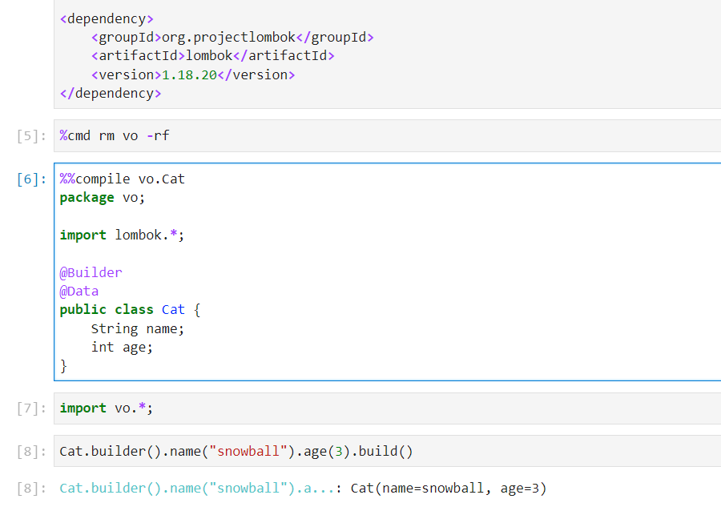
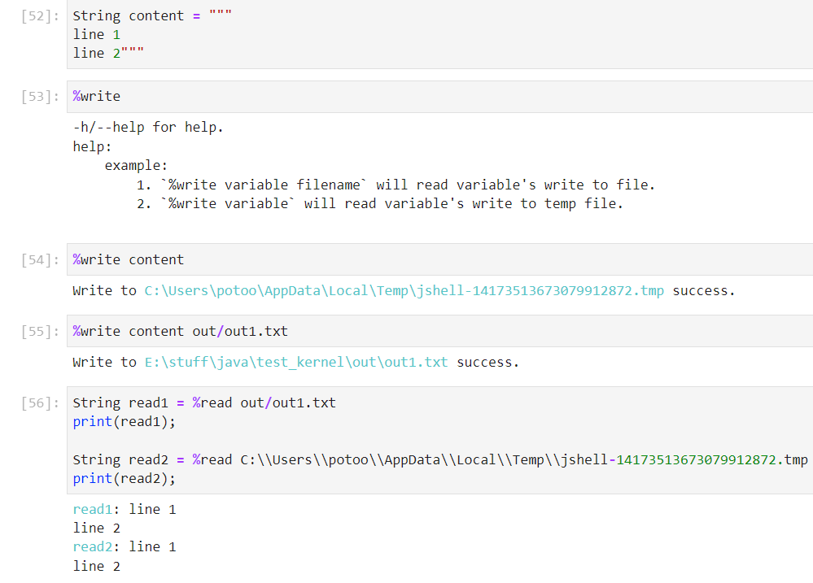
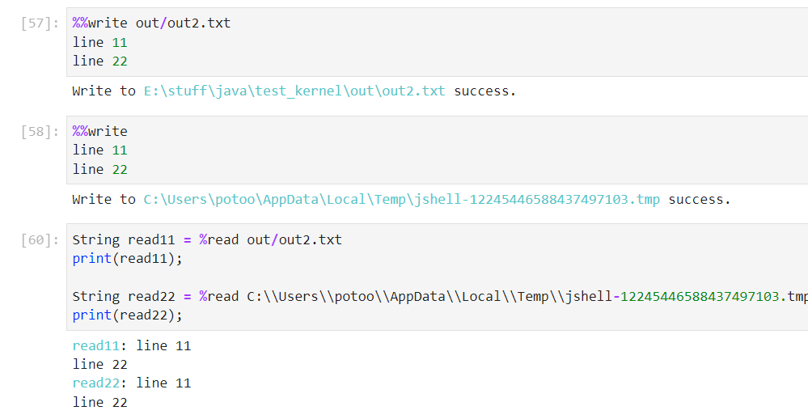
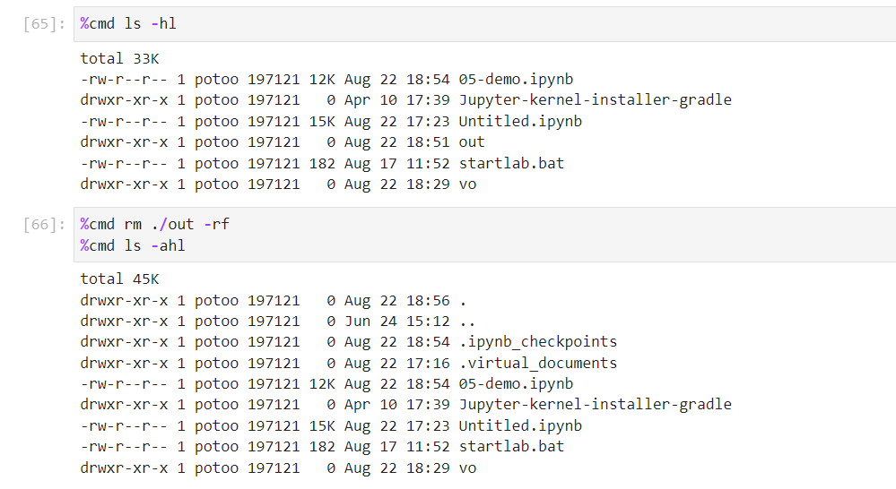

Upgrade Note:

* Fix `print` input parameter extraction error in code blocks that are called multiple times;
* add `RuntimeCompiler` util;
* add `compile` cellMagic (make sure `--add-exports=jdk.compiler/com.sun.tools.javac.processing=ALL-UNNAMED` in env *
  IJAVA_COMPILER_OPTS*)
  
* add `read/write` cell/body magic
  
  
* add `cmd` line magic
  

